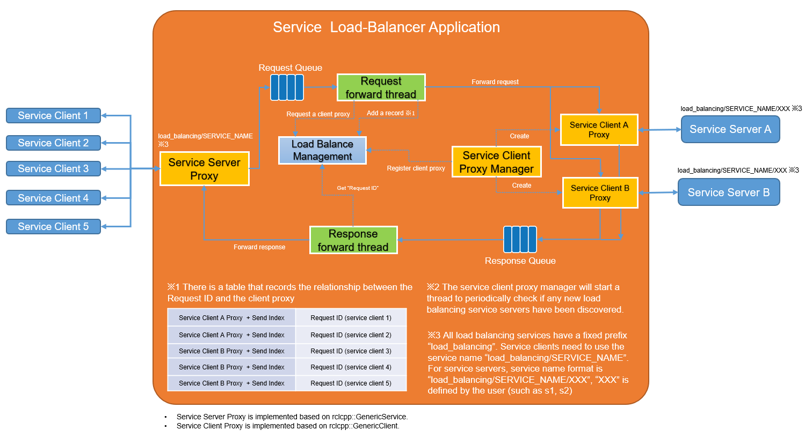

<style scoped>
section {
    font-size: 25px;
}
</style>


# [ROS 2 Load Balancing Service](https://github.com/Barry-Xu-2018/ros2_load_balancing_service)

---

# Objective

- ROS 2 service load-balancing in application layer without protocol change.
- Support multiple service servers on the same service path to have robustness and load-balancing mechanism.
- Scale / Offload ROS 2 service server/client application with remapping but code modification.

---

<!-- _header: '*ros2 load balancing service*' -->



---

# [How to use](https://github.com/Barry-Xu-2018/ros2_load_balancing_service?tab=readme-ov-file#how-to-run)

```bash
Usage:
    load_balancing_service [-h|--help] [-s|--service-name SERVICE_NAME] [-t|--service-type SERVICE_TYPE] [--strategy XXX] [-i|--interval TIME]
       --strategy choose one of "round_robin", "less_requests" and "less_response_time"
                  If not set, "round_robin" is used as default.
                  "round_robin": select the service server in order.
                  "less_requests": select the service server with the fewest requests.
                  "less_response_time": select the service server with the shortest average response time.
       --interval Interval to discovery service servers. Unit is second.
                  If not set, default is 1s.
```

---

# Configuration Parameters

- `Service Name`: This is the original service name. The service server proxy adds a fixed prefix "load_balancing", so the proxy service name becomes "load_balancing/SERVICE_NAME".
- `Service Type`: e.g) "example_interfaces/srv/AddTwoInts"
- `Strategy(optional)`: Strategy for load balancing. "round_robin"(default), "less_requests" and "less_response_time".
- `Interval(Optinoal)`: Duration(default 1 sec) how often the service server discovery action is performed.

---

<!-- _header: '*An example to run load balancing service application*' -->

# [Example](https://github.com/ros2/demos/tree/rolling/demo_nodes_cpp/src/services)

```bash
$ ros2 run load_balancing_service load_balancing_service -s add_two_ints -t example_interfaces/srv/AddTwoInts --strategy round_robin -i 1
[INFO] [1727418589.343051995] [main]: 
   Load balancing service name: /load_balancing/add_two_ints
                  Service type: example_interfaces/srv/AddTwoInts
       Load balancing strategy: round_robin
  Interval to discovery server: 1s
------------------------------
Service client remap service name to /load_balancing/add_two_ints
Service server remap service name to /load_balancing/add_two_ints/s1
```

It provides hints for the prefixed service names where clients and servers can connect.

- service client should remap service name to "/load_balancing/add_two_ints".
- service server should remap service name to "/load_balancing/add_two_ints/XXX". (`XXX` is user configuration with service backend.)

---

<!-- _header: '*An example to run service server and service client*' -->

## Start 2 service servers backend

- Run service server backend with `s1`.

```
$ ros2 run demo_nodes_cpp add_two_ints_server --ros-args -r add_two_ints:=load_balancing/add_two_ints/s1
```

- Run service server backend with `s2`.

```
$ ros2 run demo_nodes_cpp add_two_ints_server --ros-args -r add_two_ints:=load_balancing/add_two_ints/s2
```

Those service backends are discovered and connected by service load-balancer.

---

## Start 10 service clients

Open another terminal, run the this script

```bash
$ cat run_clients.sh
#!/bin/bash

for i in {1..10}
do
  ros2 run demo_nodes_cpp add_two_ints_client_async --ros-args -r add_two_ints:=load_balancing/add_two_ints &
done
```

**You will see logs that 5 requests have been received in the two terminals running the service server.**

---


## Project repository

https://github.com/barry-Xu-2018/ros2_load_balancing_service/
